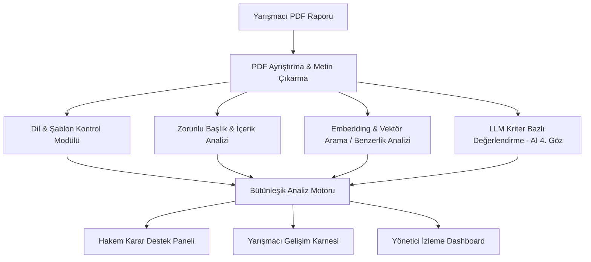

# 🚀 T-Sistem — TEKNOFEST Yapay Zekâ Destekli Değerlendirme Sistemi

> **T3 Vakfı Bursiyer Yapay Zekâ Creathonu** kapsamında **Problem 4** için geliştirilmiş uçtan uca Akıllı Hakem Karar Destek ve Rapor Değerlendirme Platformu.

---

## 📌 Problem Tanımı ve Proje Amacı (Problem 4)
TEKNOFEST yarışmalarında on binlerce başvuru raporu alınmakta; dil, şablon, başlık-içerik, kategori uygunluğu, intihal/benzerlik ve kriter bazlı puanlama gibi aşamalar hakemler üzerinde devasa bir operasyonel yük oluşturmaktadır.

**T-Sistem Çözümü:** 
Yapay zekâyı nihai bir karar verici olarak değil; kontrol, derin semantik analiz ve ön değerlendirme sunan bir **"AI 4. Göz" (Karar Destek Sistemi)** olarak konumlandırır. Böylece hakemlerin rutin kontrollerini otomatikleştirir, değerlendirme standardizasyonu sağlar ve yarışmacılara gelişim odaklı yapıcı geri bildirimler üretir.

---

## 🎯 MVP Zorunlu 6 Temel Modül
Projemiz, Creathon şartnamesinde belirtilen 6 kritik MVP şartının tamamını eksiksiz kapsar:

1. **🌐 Dil ve Şablon Uygunluk Kontrolü:** Rapor dilinin otomatik tespiti ve resmi güncel TEKNOFEST şablonuna (sayfa yapısı, font, yerleşim) uyum doğrulaması.
2. **📑 Başlık ve İçerik Kontrolü:** Zorunlu tüm ana ve alt başlıkların varlığı ile ilgili bölümlerde beklenen içeriğin bulunurluk/doluluk analizi.
3. **🎯 Kategori Uygunluğu Analizi:** Proje konusunun başvuru yapılan yarışma kategorisi ile anlamsal/semantik uyumunun tespiti.
4. **🔍 Benzerlik ve İntihal Analizi:** Başvurular arası semantik embedding ve kosinüs benzerliği ile yüksek benzerlik gösteren içeriklerin otomatik işaretlenmesi.
5. **🧠 AI Kriter Değerlendirmesi ("AI 4. Göz"):** Rubric kriterlerine göre (Özgünlük, Teknik Derinlik, Uygulanabilirlik, Etki, Sunum) ön puanlama ve gerekçelendirme.
6. **💡 Yapıcı Yarışmacı Geri Bildirimi:** Projenin güçlü yönlerini, eksikliklerini ve somut gelişim önerilerini içeren dinamik karne çıktısı.

---

## 👥 Kullanıcı Rolleri ve Akışlar
| Rol | Tanım ve Yetkiler |
| :--- | :--- |
| **👑 Yarışma Yöneticisi** | Yarışmaları tanımlar, güncel şablon/kriterleri yükler, toplu raporları sisteme aktarır ve analiz sürecini başlatır. |
| **⚖️ Hakem / Değerlendirici** | AI ön kontrollerini ve 4. göz kriter analizini inceler, puan ve notlarını vererek nihai kararı onaylar. |
| **🎓 Yarışmacı** | Değerlendirme tamamlandığında projesinin güçlü yönlerini, eksiklerini ve kişiselleştirilmiş gelişim önerilerini görüntüler. |
| **📊 Değerlendirme Yöneticisi** | Tüm analiz durumlarını, hakem tamamlama oranlarını ve yarışma genel metriğini canlı dashboard üzerinden izler. |

---

## 🏗️ Sistem Mimarisi ve Teknoloji Yığını


* **Backend:** Python / FastAPI, Pydantic, Uvicorn
* **PDF & Metin İşleme:** PyMuPDF, pdfplumber, LangChain TextSplitter
* **AI & NLP:** OpenAI GPT-4o / Llama 3, HuggingFace Embeddings, FAISS / ChromaDB
* **Frontend / Dashboard:** Modern Responsive UI (FastAPI Templates / React / Streamlit)
* **Veri & Analiz:** SQLite / PostgreSQL, Pandas, NumPy

---

## 📂 Proje Dizin Yapısı
```bash
T-Sistem/
├── data/                  # Ham PDF raporlar, işlenmiş metinler ve veri setleri
│   ├── raw/               # Yarışma raporları ve şablon dosyaları
│   └── processed/         # Ayrıştırılmış ve indekslenmiş veri çıktıları
├── docs/                  # Proje dokümantasyonu, kılavuzlar ve analizler
│   ├── kaynaklar/         # Şartname, problem kitapçığı ve akademik referanslar
│   ├── raporlar_ve_taslaklar/ # Jüri raporları ve tasarım belgeleri
│   ├── sunumlar/          # Jüri sunum slaytları
│   └── gorseller/         # Mimari diyagramlar ve ekran görüntüleri
├── notebooks/             # Ar-Ge, NLP, embedding ve prompt deneme notebook'ları
├── src/                   # Üretime hazır modüler kaynak kodlar
│   ├── ingestion/         # PDF parser ve metin temizleme
│   ├── checkers/          # Dil, şablon, başlık ve kategori doğrulayıcılar
│   ├── similarity/        # Vektör veritabanı ve benzerlik motoru
│   ├── evaluation/        # AI kriter değerlendirme ve rubric motoru
│   ├── feedback/          # Yarışmacı gelişim raporu üreteci
│   └── api/               # FastAPI REST endpoint'leri ve arayüz servisleri
├── requirements.txt       # Proje bağımlılıkları
└── README.md              # Ana proje tanıtım belgesi
```

---

## 🚀 Hızlı Başlangıç

### 1. Kurulum
```bash
git clone https://github.com/mehmetcelikcmyk/T-Sistem.git
cd T-Sistem
python -m venv venv
# Windows:
venv\Scripts\activate
# Linux/Mac:
source venv/bin/activate
pip install -r requirements.txt
```

### 2. Ortam Değişkenleri
Proje kökünde `.env` dosyası oluşturun. **Bu dosya `.gitignore` içindedir, asla commit edilmez.**
```env
# Birincil LLM motoru — virgülle ayırarak birden fazla anahtar verilebilir
# (round-robin yük dengeleme + otomatik failover devreye girer)
ANTHROPIC_API_KEYS=sk-ant-xxx1,sk-ant-xxx2,sk-ant-xxx3

# Yedek LLM sağlayıcısı (Claude havuzu tükenirse otomatik denenir)
OPENAI_API_KEY=sk-xxx

# Opsiyonel — Cloudflare R2 nesne depolama (PDF arşivi)
CLOUDFLARE_R2_ENDPOINT_URL=
CLOUDFLARE_R2_ACCESS_KEY=
CLOUDFLARE_R2_SECRET_KEY=
CLOUDFLARE_R2_BUCKET_NAME=t-sistem-raporlar

# Opsiyonel — Cloudflare D1 bulut veritabanı senkronizasyonu
CLOUDFLARE_ACCOUNT_ID=
CLOUDFLARE_D1_DATABASE_ID=
CLOUDFLARE_API_TOKEN=

# Opsiyonel — frontend adresleri (belirtilmezse tüm kaynaklara izin verilir)
CORS_ALLOWED_ORIGINS=http://localhost:3000,http://localhost:5173
```

> Hiçbir LLM anahtarı tanımlanmazsa sistem **çökmez**: dahili heuristic
> değerlendirme motoru devreye girer ve demo kesintisiz çalışır.

### 3. Uygulamayı Çalıştırma
Proje **kök dizininden** (`T-Sistem/`) çalıştırın:
```bash
# Önerilen (otomatik yeniden yükleme ile)
uvicorn src.main:app --reload

# Alternatif
python src/main.py
```
Ardından tarayıcıdan açın:
* Swagger arayüzü → http://localhost:8000/docs
* Sistem durumu → http://localhost:8000/health

---

## 👥 T-Sistem Ekibi
* **Mehmet Çelik** — Backend API, AI Modül Entegrasyonu & Prompt Mühendisliği
* **Birhan** — PDF Pipeline, Vektör Veritabanı & Semantik Benzerlik Analizi
* **Emre** — Frontend / Arayüz Geliştirme, Dashboard & Görselleştirme
