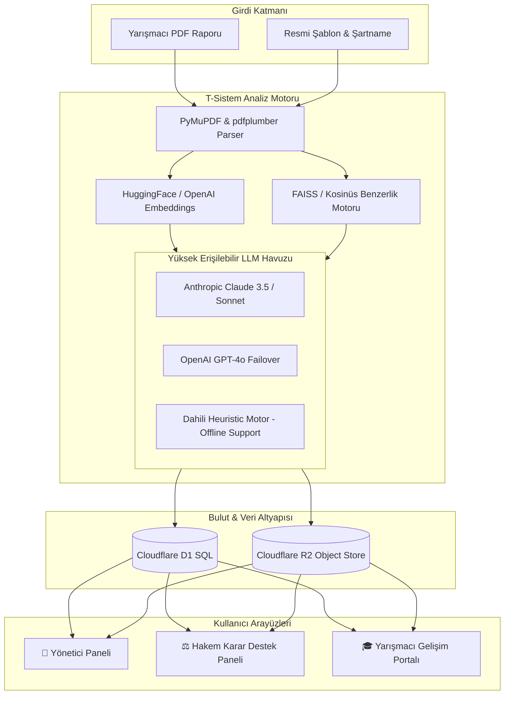

<div align="center">

# 🚀 T-Sistem (Versiyon 4)
### TEKNOFEST Yapay Zekâ Destekli Akıllı Rapor Değerlendirme & Hakem Karar Destek Platformu

> **T3 Vakfı Bursiyer Yapay Zekâ Creathonu** kapsamında **Problem 4** için geliştirilmiş; Hibrit LLM Motoru, Cloudflare D1/R2 mimarisi ve "AI 4. Göz" yaklaşımı sunan uçtan uca değerlendirme ekosistemi.

[](https://python.org)
[](https://fastapi.tiangolo.com)
[](https://streamlit.io)
[](https://cloudflare.com)
[](LICENSE)

[📌 Problem & Çözüm](#-problem-tanımı-ve-t-sistem-çözümü) •
[🎯 Core MVP Modülleri](#-mvp-6-temel-analiz-modülü) •
[🏗️ Mimari](#-mimari-ve-hibrit-yapay-zekâ-motoru) •
[👥 Kullanıcı Rolleri](#-kullanıcı-rolleri-ve-deneyim-akışları) •
[🚀 Kurulum](#-hızlı-başlangıç)

---

</div>

## 📌 Problem Tanımı ve T-Sistem Çözümü

TEKNOFEST yarışmalarında her yıl **60'tan fazla kategoride on binlerce rapor** sunulmaktadır. Hakem kurulunun karşı karşıya kaldığı temel operasyonel güçlükler:
- Sayfa yapısı, font, başlık hiyerarşisi gibi **rutin şablon kontrolleri** nedeniyle harcanan aşırı zaman.
- Raporların ilgili kategori şartnamesine **anlamsal (semantik) uyumunun** manuel tespit zorluğu.
- Başvurular arası **intihal ve yüksek benzerliklerin** binlerce belge içinde gözden kaçabilmesi.
- Yarışmacılara verilecek **gelişim odaklı yapıcı geri bildirimlerin** zaman kısıtı sebebiyle yüzeysel kalması.

### 💡 "AI 4. Göz" Yaklaşımı
T-Sistem, yapay zekâyı kararı tek başına veren bir mekanizma olarak değil; **Hakem Kuruluna veri, analiz ve öneri sunan şeffaf bir "Karar Destek Asistanı" (4. Göz)** olarak konumlandırır. Sistem ön değerlendirmeleri tamamlar, işaretlemeleri yapar ve hakemin onayına sunar.

---

## 🎯 MVP 6 Temel Analiz Modülü

T-Sistem Versiyon 4, Creathon şartnamesinde tanımlanan 6 temel analitik gereksinimi tam modüler yapıda sunar:

```
┌─────────────────────────────────────────────────────────────────────────┐
│                        T-SİSTEM ANALİZ DÖNGÜSÜ                          │
└─────────────────────────────────────────────────────────────────────────┘
        │
        ├── 1. 🌐 Dil & Şablon Doğrulama (Resmi TEKNOFEST Font/Sayfa Tespiti)
        ├── 2. 📑 Başlık & İçerik Varlık Analizi (Eksik Bölüm & Hiyerarşi)
        ├── 3. 🎯 Kategori Semantik Uygunluğu (Şartname Vektör Eşleşmesi)
        ├── 4. 🔍 Çapraz İntihal & Benzerlik (FAISS / Kosinüs Embedding)
        ├── 5. 🧠 "AI 4. Göz" Rubric Puanlama (Kriter Bazlı Gerekçelendirme)
        └── 6. 💡 Yapıcı Gelişim Karnesi (Yarışmacı Özel PDF & Görsel Rapor)
```

1. **🌐 Dil ve Şablon Uygunluk Kontrolü:** Rapor dilinin otomatik tespiti ve resmi güncel TEKNOFEST şablonuna (sayfa yapısı, font, marjin, kapak düzeni) %100 dijital doğrulama.
2. **📑 Başlık ve İçerik Kontrolü:** Şartnamede zorunlu kılınan ana ve alt başlıkların varlığı ile ilgili bölümlerdeki içerik doluluk ve tutarlılık analizi.
3. **🎯 Kategori Uygunluk Analizi:** Proje konusunun başvuru yapılan yarışma kategorisi ile anlamsal/semantik uyumunun vektörel tespiti.
4. **🔍 Çapraz Benzerlik & İntihal Analizi:** Başvurular arasında semantik embedding ve kosinüs benzerliği ile yüksek benzerlik gösteren paragrafların otomatik işaretlenmesi.
5. **🧠 AI Kriter Değerlendirmesi ("AI 4. Göz"):** Rubric kriterlerine göre (Özgünlük, Teknik Derinlik, Uygulanabilirlik, Etki, Sunum) ön puanlama ve kanıta dayalı gerekçelendirme.
6. **💡 Yapıcı Yarışmacı Gelişim Karnesi:** Projenin güçlü yönlerini, eksikliklerini ve somut gelişim tavsiyelerini içeren dinamik karneler.

---

## 🏗️ Mimari ve Hibrit Yapay Zekâ Motoru

Versiyon 4 ile sistem; yüksek erişilebilirlik, sıfır kesinti ve esnek LLM altyapısı için baştan tasarlandı:



### ⚡ Öne Çıkan Teknik Özellikler (Versiyon 4)
- **Harici Yük Dengelemeli LLM Havuzu:** Virgülle ayrılmış çoklu API anahtarı desteği (Round-robin yük dengeleme + Otomatik Failover).
- **Offline / Zero-Key Desteği:** Hiçbir LLM API anahtarı tanımlanmasa dahi sistem çökmez; dahili *heuristic* analiz motoru devreye girer.
- **Cloudflare D1 & R2 Entegrasyonu:** Milyonlarca rapor verisini bulutta ışık hızında SQLite mimarisi (D1) ve Nesne Depolama (R2) ile saklama yeteneği.

---

## 👥 Kullanıcı Rolleri ve Deneyim Akışları

| Rol | Görsel Panel | Yetki ve Sorumluluklar |
| :--- | :--- | :--- |
| **👑 Yarışma Yöneticisi** | `Yönetici Paneli` | Yarışmaları ve rubrikleri tanımlar, şablon yükler, toplu analiz başlatır ve süreç metriğini izler. |
| **⚖️ Hakem / Değerlendirici** | `Hakem Paneli` | AI tarafından hazırlanan 4. göz ön raporunu, intihal skorunu ve başlık analizini inceler, puanı onaylar/düzenler. |
| **🎓 Yarışmacı** | `Yarışmacı Portalı` | Değerlendirmesi tamamlanan raporunun detaylı karne çıktısını, eksik yönlerini ve AI önerilerini görüntüler. |
| **📊 Sistem Yöneticisi** | `Admin Dashboards` | Kullanıcı yetkilendirmeleri, hakem atamaları ve genel sistem sağlığını canlı olarak takip eder. |

---

## 🛠️ Teknoloji Yığını

* **Core & Backend:** Python 3.10+, FastAPI, Pydantic v2, Uvicorn
* **Arayüz (Frontend):** Streamlit (Custom Theme & Responsive Glassmorphism Design)
* **Veritabanı & Storage:** Cloudflare D1 (Serverless SQL), Cloudflare R2 (Object Storage), SQLite
* **AI, NLP & Embeddings:** Anthropic Claude API, OpenAI GPT-4o, LangChain, FAISS, HuggingFace Sentence-Transformers
* **Doküman Ayrıştırma:** PyMuPDF (FitZ), pdfplumber, python-docx

---

## 🚀 Hızlı Başlangıç

### 1. Depoyu Klonlayın ve Bağımlılıkları Yükleyin

```bash
git clone https://github.com/mehmetcelikcmyk/T-Sistem.git
cd T-Sistem

# Sanal ortam oluşturma
python -m venv venv

# Sanal ortamı aktifleştirme (Windows)
venv\Scripts\activate
# Sanal ortamı aktifleştirme (Linux / macOS)
# source venv/bin/activate

# Paketleri yükleme
pip install -r requirements.txt
```

### 2. Ortam Değişkenleri (`.env`)

Proje kök dizininde `.env` dosyası oluşturun (Örnek yapı için `.env.example` dosyasını kullanabilirsiniz):

```env
# Birincil LLM motoru (Virgülle ayırarak çoklu anahtar verebilirsiniz)
ANTHROPIC_API_KEYS=sk-ant-xxx1,sk-ant-xxx2

# Yedek LLM motoru
OPENAI_API_KEY=sk-xxx

# Cloudflare D1 & R2 Bulut Veri Yapılandırması (Opsiyonel)
CLOUDFLARE_R2_ENDPOINT_URL=https://<account_id>.r2.cloudflarestorage.com
CLOUDFLARE_R2_ACCESS_KEY=<access_key>
CLOUDFLARE_R2_SECRET_KEY=<secret_key>
CLOUDFLARE_R2_BUCKET_NAME=t-sistem-raporlar
```

> 💡 **Not:** Herhangi bir API anahtarı girmeden de uygulamayı çalıştırabilirsiniz. Sistem otomatik olarak dahili demo/heuristic modda çalışacaktır.

### 3. Uygulamayı Çalıştırın

Proje kök dizininden tek bir komutla başlatın:

```bash
python start.py
```
veya doğrudan Streamlit arayüzünü açın:
```bash
streamlit run src/ui/app.py
```

---

## 👥 T-Sistem Ekibi

* **Mehmet Çelik** — Backend API Mimarisi, AI Entegrasyonu & Prompt Mühendisliği
* **Birhan** — PDF Pipeline, Vektör Veritabanı & Semantik Benzerlik Analizi
* **Emre** — Frontend / Streamlit Arayüz Geliştirme & UX Tasarımı

---

<div align="center">

Made with ❤️ for **TEKNOFEST & T3 Vakfı Creathon**

</div>
